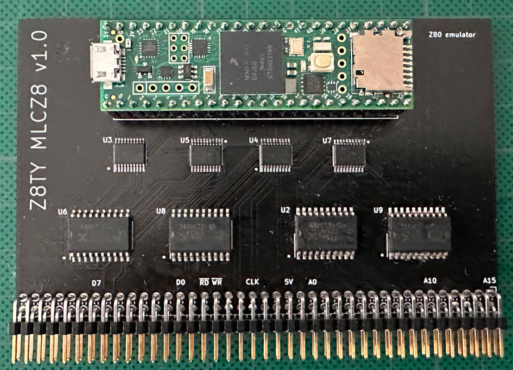
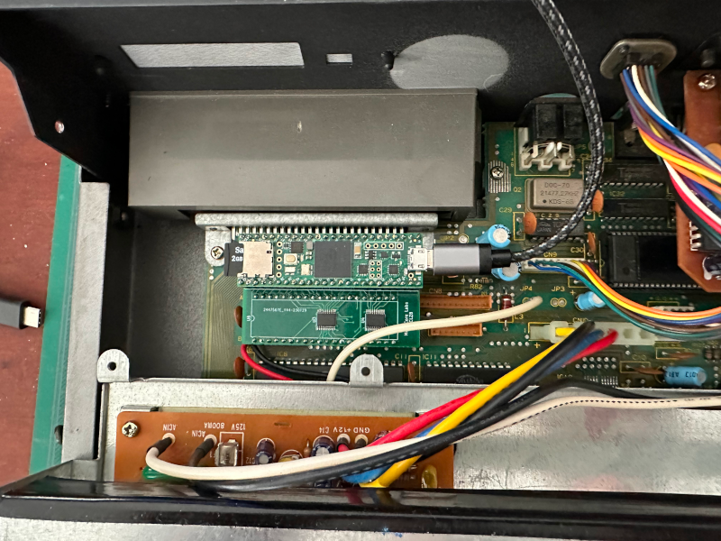

# Z8TY MCLZ8

Version of MicoLabs MCLZ8 Z80 replacement using a Teensy 4.1 microcontroller.
See https://github.com/MicroCoreLabs for the original.

This version focuses on using the MCLZ8 as a Z80 replacement for MSX computers.
The first incarnation is used as a test version running on my DIY MSX (Z8TY).

Depending on interest, versions for specific MSX (1/2) computers will be added to replace the DIP40 Z80 with the MCLZ8.

Status:

    Z8TY MCLZ8 working as a Z80 replacement for my DIY MSX. Boots to DOS2 using Carnivore 2 cartridge in MSX1, MSX2, 2+ and Turbo-R mode.
    Uses the Teensy 4.1 micro SD card slot to load the MSX BIOS roms.

The original MCLZ8 adapter working in a Toshiba HX-34 MSX2.

